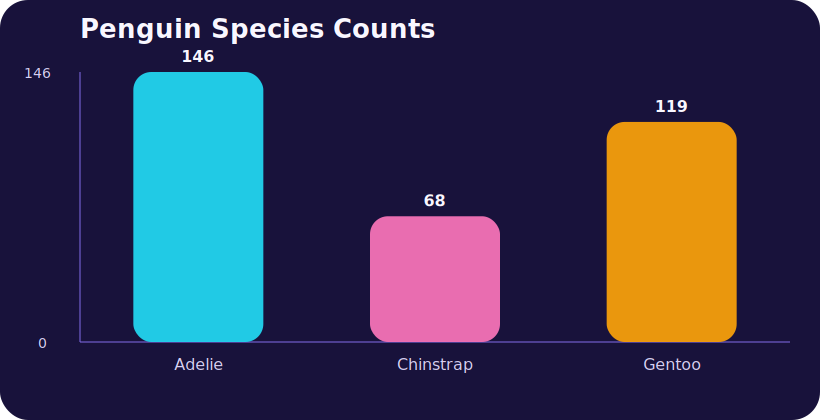
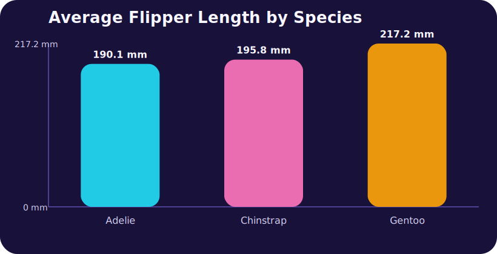
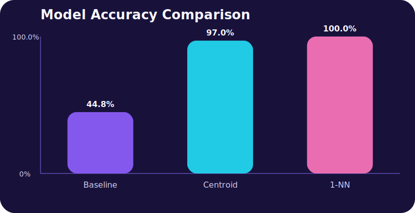

# Palmer Penguins Species Classification

## Title

Palmer Penguins Species Classification

## Objective

Use a real-world penguin dataset to explore patterns, compare simple classifiers,
and practice an end-to-end machine learning workflow that includes cleaning,
feature selection, evaluation, and communication.

## Process

1. Downloaded the Palmer Penguins dataset.
2. Removed rows with missing numeric values or missing labels.
3. Used four numeric features: bill length, bill depth, flipper length, and body mass.
4. Split the cleaned dataset into deterministic training and test sets.
5. Compared a majority-class baseline, a nearest centroid classifier, and a
   1-nearest-neighbor classifier.
6. Exported results tables and visual summaries for the portfolio.

## Tools

- PowerShell
- CSV data processing
- Static SVG charts
- GitHub Pages compatible HTML, Markdown, and image assets

## Value Proposition

This project demonstrates that I can take raw data, structure an analysis,
build repeatable code, compare model behavior, and communicate results clearly in
a format that can be shared online.

## Best Fit Roles

- Junior machine learning engineer
- Data analyst or analytics engineer
- Software engineer working on data-heavy product features

## Why It Matters

Even though this is a small benchmark project, the workflow mirrors real ML and
analytics work: clean imperfect data, establish a baseline, compare simple
models, and communicate results in a way other people can quickly review and
trust.

## Dataset Snapshot

- Raw rows in source file: 344
- Clean rows used for analysis: 333
- Training rows: 266
- Test rows: 67

## Model Results

| Model | Accuracy | Correct / Total |
| --- | ---: | ---: |
| Majority class baseline | 44.8% | 30 / 67 |
| Nearest centroid classifier | 97% | 65 / 67 |
| 1-nearest-neighbor classifier | 100% | 67 / 67 |

## Key Takeaways

- The majority baseline offers a quick reference point, but it ignores the
  penguins' feature values.
- The nearest centroid model performs strongly while staying simple and easy to
  explain.
- The 1-nearest-neighbor model achieved the best accuracy in this project,
  showing that even simple distance-based methods can separate these species well.

## Deliverables Included

- penguins.csv
- generate-artifact.ps1
- species-summary.csv
- model-results.csv
- best-model-confusion-matrix.csv
- species-counts.svg
- average-flipper-length.svg
- model-accuracy.svg

## Visuals

