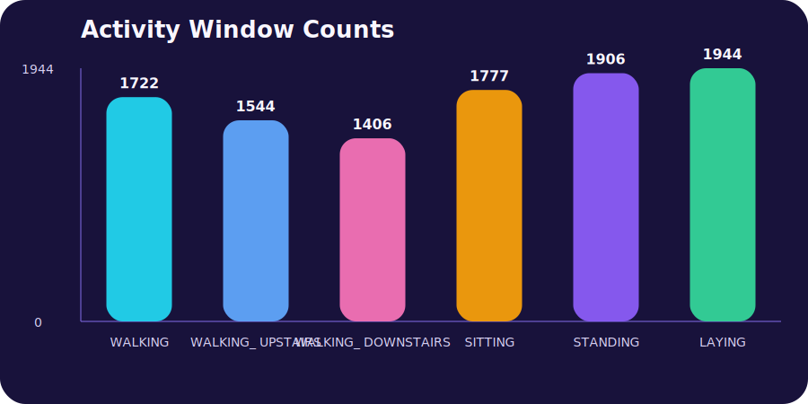
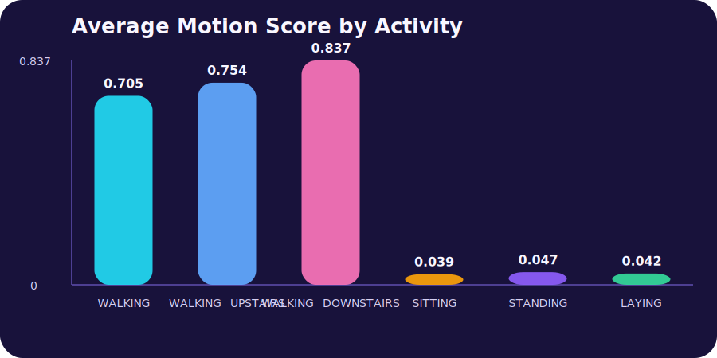
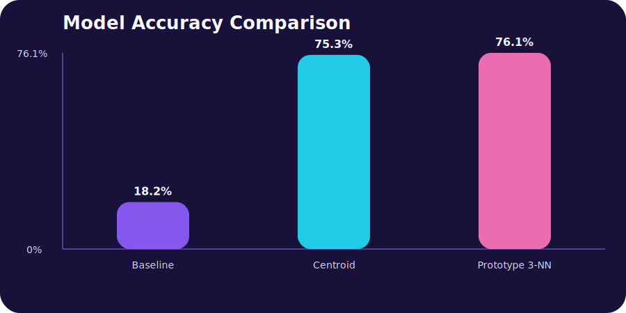

# Robot Sensor Data Classification

## Title

Robot Sensor Data Classification

## Objective

Use a public inertial-sensor dataset to classify motion and posture states, then
present the workflow as a shareable machine learning project with downloadable
results and visual summaries.

## Process

1. Downloaded the UCI Human Activity Recognition Using Smartphones dataset.
2. Selected 18 accelerometer and gyroscope summary features that describe motion.
3. Preserved the official train and test split from the source dataset.
4. Compared a majority baseline, a nearest centroid classifier, and a prototype
   3-nearest-neighbor classifier.
5. Exported charts, comparison tables, and project files for the portfolio.

## Tools

- PowerShell
- CSV data processing
- Static SVG chart generation
- GitHub Pages compatible HTML, Markdown, and downloadable assets

## Value Proposition

This project demonstrates my ability to work with sensor-oriented data, structure
repeatable analysis workflows, and connect machine learning outputs to a
robotics-adjacent use case that is easy to review publicly.

## Dataset Snapshot

- Source dataset: UCI Human Activity Recognition Using Smartphones
- Subjects: 30
- Activities: 6
- Training windows: 7352
- Test windows: 2947
- Selected features: 18

## Activity Labels

- WALKING
- WALKING_UPSTAIRS
- WALKING_DOWNSTAIRS
- SITTING
- STANDING
- LAYING

## Model Results

| Model | Accuracy | Correct / Total |
| --- | ---: | ---: |
| Majority activity baseline | 18.2% | 537 / 2947 |
| Nearest centroid classifier | 75.3% | 2220 / 2947 |
| Prototype 3-nearest-neighbor classifier | 76.1% | 2243 / 2947 |

## Key Takeaways

- Sensor windows describing walking and posture can be separated effectively with
  a relatively small number of engineered features.
- The nearest centroid model offers an interpretable summary of activity classes.
- The prototype 3-nearest-neighbor model captured local motion patterns and
  achieved the best accuracy in this project.

## Deliverables Included

- selected-sensor-windows.csv
- selected-feature-reference.csv
- activity-summary.csv
- model-results.csv
- best-model-confusion-matrix.csv
- activity-counts.svg
- motion-score.svg
- model-accuracy.svg
- generate-project.ps1

## Visuals

